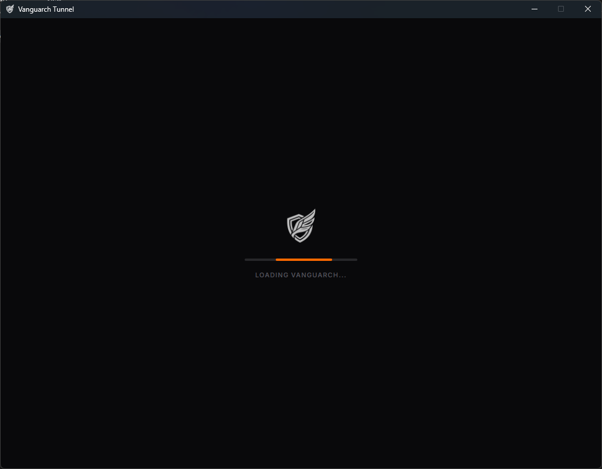
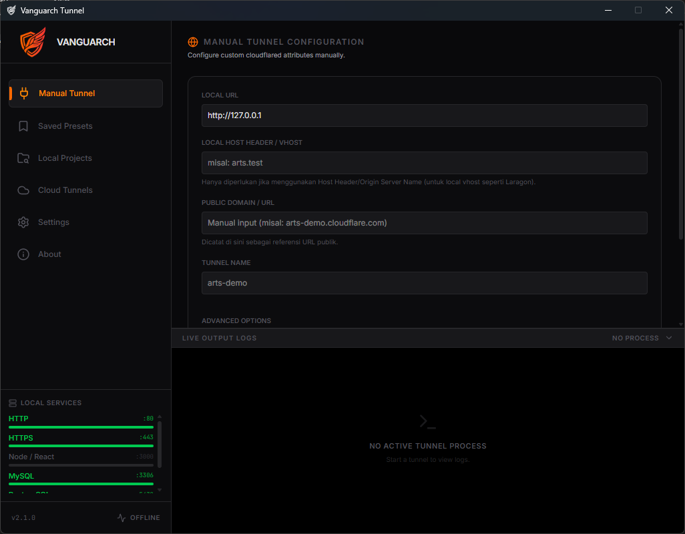
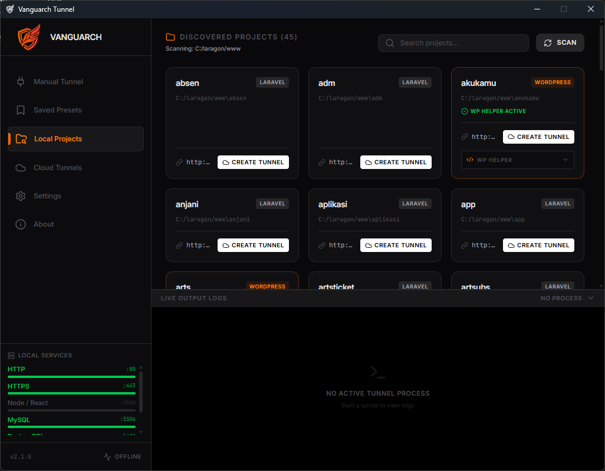
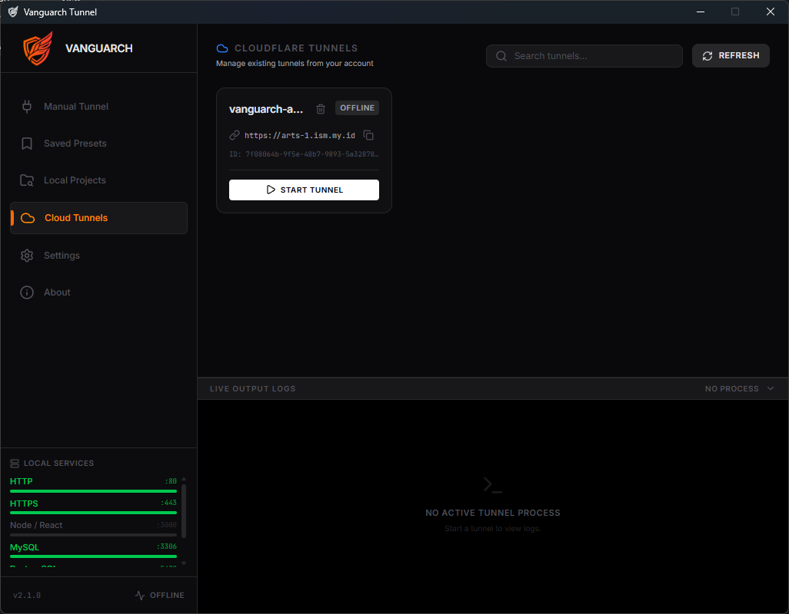
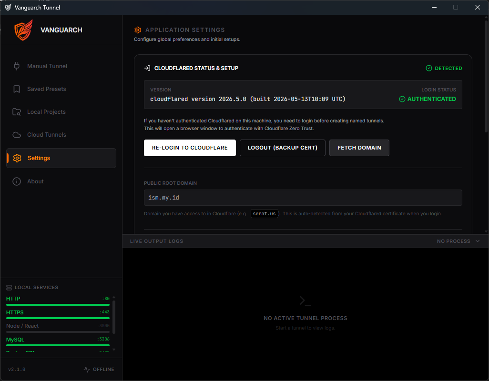
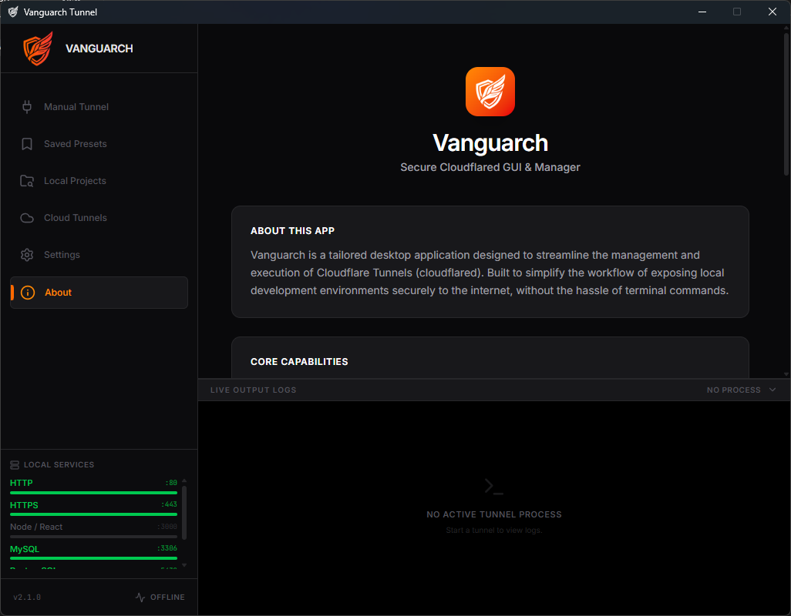

<div align="center">
  
  <h1>Vanguarch Tunnel</h1>
  <p>A desktop GUI for Cloudflare Argo Tunnel (<code>cloudflared</code>)</p>
</div>

---

Vanguarch Tunnel is a desktop application built with Tauri and React that simplifies exposing local development environments to the internet via Cloudflare Tunnels. It provides a graphical interface for managing tunnels without relying solely on the command-line interface.

## Features

- **Local Project Discovery:** Scans workspace directories and automatically detects frameworks such as WordPress, Laravel, Next.js, and Vite.
- **Tunnel Management:** Create, view, and route tunnels to a public domain for any discovered project.
- **WordPress Helper:** Inject configurations into `wp-config.php` to resolve mixed content and HTTPS issues when routed over Cloudflare.
- **Cloud Integration:** View and delete existing tunnels directly from your Cloudflare Zero Trust account.
- **Live Logs:** Built-in terminal log viewer and port status monitoring.
- **Auto Updater:** Built-in update checker for the `cloudflared` binary.
- **Saved Presets:** Save tunnel configurations for quick access.

## Previews

### Dashboard & Project Discovery


### Manual Tunnel & Live Logs


### Cloud Tunnels Management


### Saved Presets


### Application Settings & Cloudflare Auth


### About & System Status


## Tech Stack

- **Frontend:** React, TypeScript, Tailwind CSS, Vite, Zustand
- **Backend:** Rust, Tauri API
- **Core Engine:** Cloudflare `cloudflared` daemon

## Installation & Setup

### Prerequisites
- [Node.js](https://nodejs.org/) (v18+)
- [Rust](https://www.rust-lang.org/tools/install)
- Cloudflare account with a registered domain

### Build from source

1. Clone the repository:
   ```bash
   git clone https://github.com/khoirulaksara/vanguarch-tunnel.git
   cd vanguarch-tunnel
   ```

2. Install dependencies:
   ```bash
   npm install
   ```

3. Run in development mode:
   ```bash
   npm run tauri dev
   ```

4. Build the executable:
   ```bash
   npm run tauri build
   ```

## Configuration

On the first run, navigate to the **Settings** tab:
1. Click **Login to Cloudflare** to authenticate `cloudflared`.
2. The application will detect and fetch your Public Root Domain.
3. Add your local web development folders to the **Workspace Directories** (e.g. `C:\laragon\www` or `/var/www/html`) to enable automatic project discovery.

## License

This project is licensed under the MIT License.
